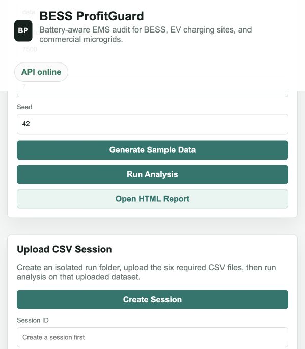
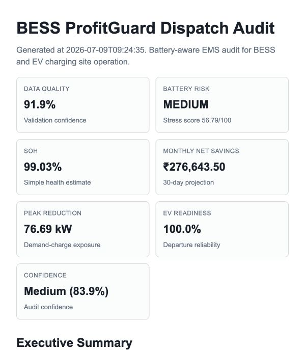

# BESS ProfitGuard

[](https://github.com/HemangGadhvi04/bess-profitguard/actions/workflows/tests.yml)

Degradation-aware BESS EMS for EV charging sites and commercial microgrids.

> Should the battery operate right now, or will the lifetime damage cost more than the money earned?

## Demo Screenshots

Dashboard after running the sample EV depot analysis:



Generated commercial audit report:



## Quick Start

Install dependencies:

```bash
python3 -m pip install -r requirements.txt
```

Run the complete demo pipeline:

```bash
python3 run_demo.py
```

Run checks:

```bash
make lint
make test
```

Run the API and dashboard:

```bash
make serve
```

Open:

```txt
http://127.0.0.1:8000/dashboard/
http://127.0.0.1:8000/api/report/html
```

## Sample Result

```txt
Generated sample EV depot data
Validated data quality
Calculated battery health
Calculated degradation cost
Compared dispatch strategies
Generated audit report

Validation: PASS
No battery cost: ₹49,754.66
Energy-cost-only net savings: ₹9,166.65
Degradation-aware net savings: ₹9,221.45
Recommended strategy: Use degradation-aware dispatch in Profit Mode; it protects net value after battery lifetime cost.

Report generated:
reports/bess_profitguard_report.html
```

## Architecture

```txt
backend/app/main.py                    FastAPI app, security middleware, API routes
backend/app/services/data_generator.py Synthetic BESS, PV, load, tariff, and EV data
backend/app/services/telemetry_validator.py
                                        CSV validation and feasibility checks
backend/app/services/battery_health.py  SoH, EFC, C-rate, temperature, and stress score
backend/app/services/degradation_cost.py
                                        Battery lifetime cost model
backend/app/services/demand_charge.py   Peak demand and peak-shaving savings
backend/app/services/ev_scheduler.py    EV readiness and priority readiness summaries
backend/app/services/operating_modes.py Profit/protection/readiness mode configuration
backend/app/services/dispatch_optimizer.py
                                        LP-based BESS + EV depot optimizer
backend/app/services/report_generator.py
                                        Commercial HTML audit report
frontend/                               Lightweight dashboard
tests/                                  Unit and API tests
docs/                                   Model docs, roadmap, case study, limitations
```

## Features

- Synthetic 7-day, 15-minute EV depot dataset generation.
- CSV validation for telemetry, tariff, PV, site load, EV sessions, and battery config.
- Battery health estimate with EFC, SoH, C-rate, temperature exposure, and stress score.
- Degradation cost model using replacement cost, cycle life, stress, SoH, temperature, and SoC dwell.
- Dispatch comparison for no battery, energy-cost-only dispatch, and degradation-aware dispatch.
- Demand charge modeling with peak grid import and peak-shaving savings.
- EV charging optimization with arrival/departure windows and readiness metrics.
- Operating modes: `profit_mode`, `battery_protection_mode`, and `ev_readiness_mode`.
- Commercial audit report with data quality score, monthly savings, stress events, and limitations.
- FastAPI backend with upload/session support.
- Lightweight dashboard for running the pipeline and opening the report.
- GitHub Actions CI plus local `make lint` and `make test`.

## Case Study

The sample EV depot case study compares no-battery operation, energy-cost-only dispatch, and ProfitGuard dispatch.

| Strategy | Energy Cost | Demand Charge | Net Savings | EV Readiness | Peak Demand | Discharge Energy |
| --- | ---: | ---: | ---: | ---: | ---: | ---: |
| No battery | ₹49,754.66 | ₹25,274.91 | ₹0.00 | 100.00% | 269.60 kW | 0.00 kWh |
| Energy-cost-only | ₹39,474.74 | ₹18,084.80 | ₹9,166.65 | 100.00% | 192.91 kW | 401.06 kWh |
| Degradation-aware | ₹39,901.32 | ₹18,084.80 | ₹9,221.45 | 100.00% | 192.91 kW | 227.64 kWh |

Key result: degradation-aware dispatch uses about 173 kWh less battery discharge than energy-cost-only dispatch while producing higher net savings after degradation cost.

Full case study: [docs/case_study_ev_depot.md](docs/case_study_ev_depot.md)

## API Endpoints

- `GET /api/status`
- `POST /api/sample-data`
- `POST /api/sessions`
- `POST /api/sessions/{session_id}/upload`
- `GET /api/sessions/{session_id}/files`
- `GET /api/validation`
- `GET /api/battery-health`
- `POST /api/degradation-cost`
- `POST /api/dispatch`
- `POST /api/report`
- `GET /api/report/html`

Example dispatch request:

```bash
curl -X POST http://127.0.0.1:8000/api/dispatch \
  -H "Content-Type: application/json" \
  -d '{"data_dir":"data","dispatch_revenue":7500,"operating_mode":"profit_mode"}'
```

Allowed operating modes:

- `profit_mode`
- `battery_protection_mode`
- `ev_readiness_mode`

## Docs

- [Commercial Positioning](docs/10-commercial-positioning.md)
- [Product Improvement Roadmap](docs/11-product-improvement-roadmap.md)
- [EV Depot Case Study](docs/case_study_ev_depot.md)
- [Dispatch Optimization Model](docs/optimization_model.md)
- [Degradation Cost Model](docs/degradation_model.md)
- [Demand Charge Model](docs/demand_charge_model.md)
- [EV Charging Optimization](docs/ev_charging_optimization.md)
- [Operating Modes](docs/operating_modes.md)
- [System Limitations](docs/limitations.md)
- [Master Roadmap PDF](<docs/strategy/Master Roadmap- University → Energy Infrastructure Software Company.pdf>)

## Limitations

- This is decision-support software, not OEM-certified battery degradation prediction.
- The current dispatch horizon is 24 hours with perfect foresight.
- Demand charge modeling is simplified and does not yet include utility-specific monthly ratchets.
- EV charging output is currently aggregate in the schedule; per-vehicle timelines are planned.
- The app is not a live EMS controller and should not directly control hardware without safety integration.

## Roadmap

- `v0.2`: demo-ready release with screenshots, one-command demo, and clean README.
- `v0.3`: commercial audit report with assumptions, limitations, sensitivity, and monthly savings.
- `v0.4`: commercial EMS optimizer with demand charge, EV readiness, and operating modes.
- `v0.5`: professional software quality with stronger tests, CI, Docker, API docs, and session history.
- `v0.6`: Germany/research strength with rainflow cycle counting and validation docs.
- `v0.7`: pilot-ready SaaS with persistent projects, report history, and deployment.

## Security Posture

- Strict Pydantic request schemas with extra fields rejected.
- Generic validation and server error responses.
- Server-side exception logging without stack traces in API responses.
- Explicit CORS origins through `ALLOWED_ORIGINS`.
- Security headers for API and dashboard responses.
- Basic in-memory rate limiting for `/api/*`.
- Upload size limit through `MAX_UPLOAD_BYTES`.
- CSV-only upload checks.
- Path traversal protection for `data`, `runs`, and `reports`.
- FastAPI docs disabled when `APP_ENV=production`.

Production environment example:

```bash
APP_ENV=production
ALLOWED_ORIGINS=https://your-domain.example
MAX_UPLOAD_BYTES=5242880
RATE_LIMIT_REQUESTS=120
RATE_LIMIT_WINDOW_SECONDS=900
```

## GitHub About

Recommended repository description:

```txt
Degradation-aware BESS EMS for EV charging sites and commercial microgrids.
```

Recommended topics:

```txt
bess
energy-storage
battery-degradation
ev-charging
microgrid
fastapi
optimization
energy-management-system
battery-health
python
```

## Resume Bullets

- Built a FastAPI-based BESS dispatch audit platform for EV depots and commercial microgrids.
- Modeled battery degradation cost, demand charge savings, EV readiness, reserve SoC, and dispatch net savings.
- Implemented a linear-program optimizer comparing no-battery, energy-cost-only, and degradation-aware strategies.
- Added production-minded validation, upload sessions, security middleware, CI, tests, and commercial HTML reports.
